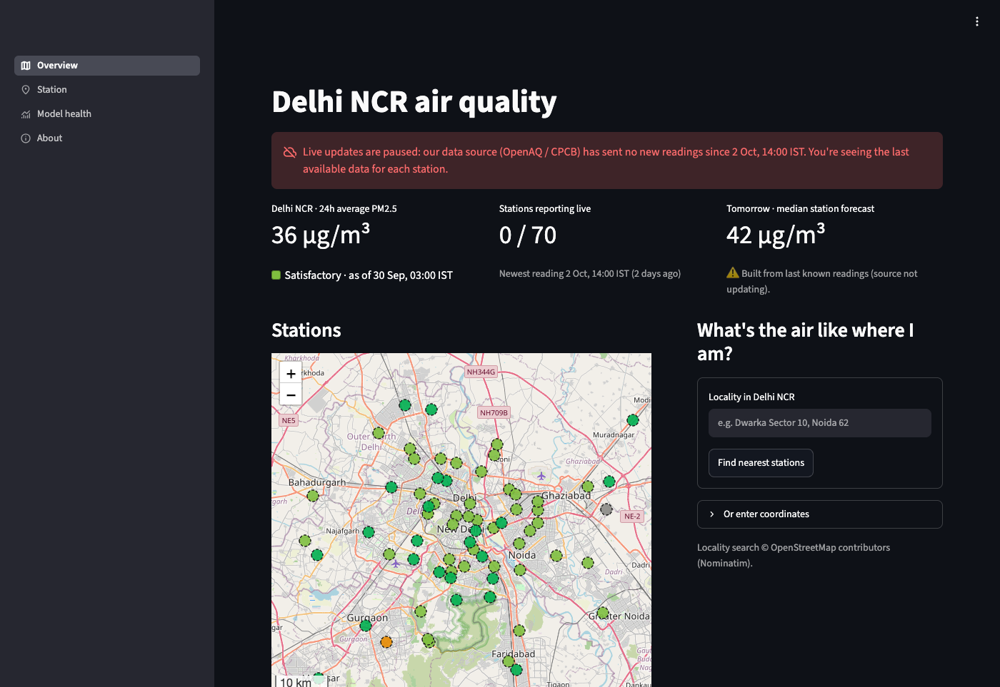
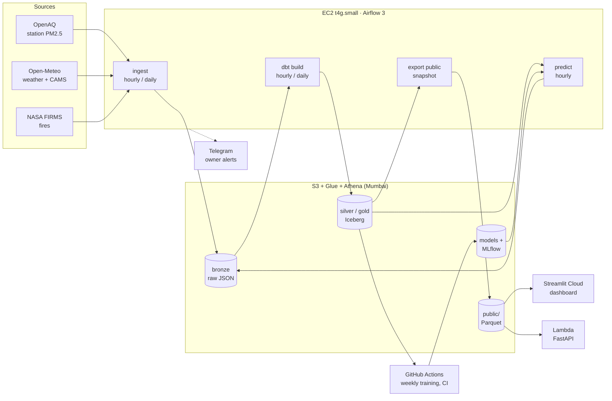
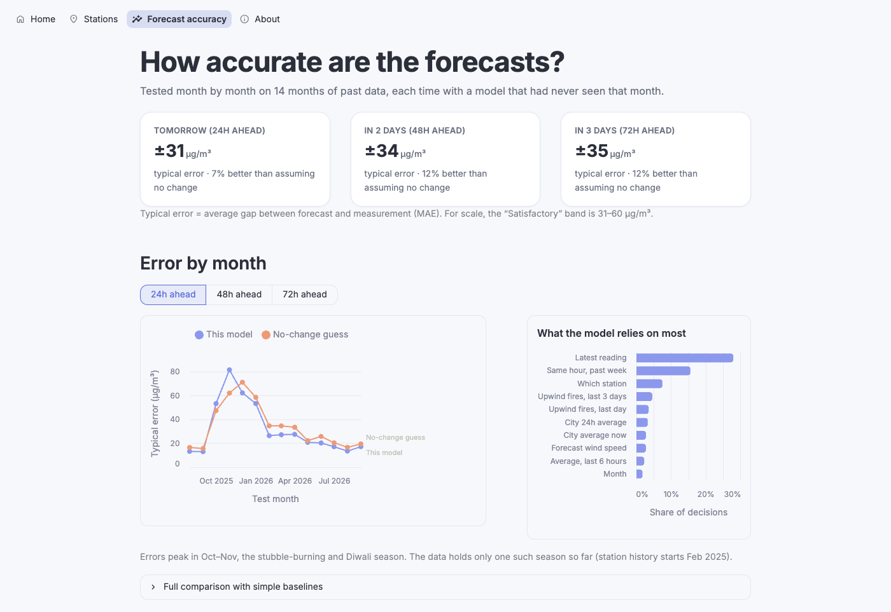
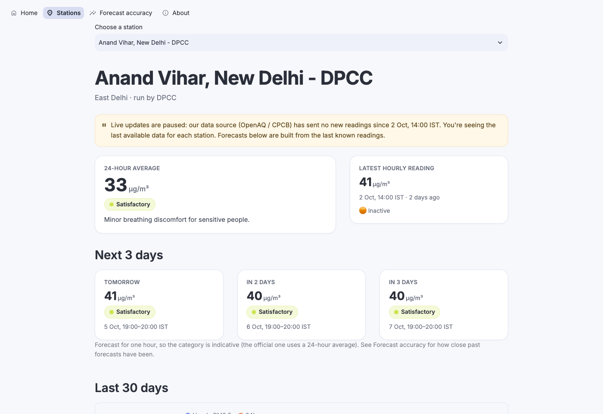

# CheckYourAQI

PM2.5 forecasts for Delhi NCR, 24, 48 and 72 hours ahead, for 70 government monitoring stations.
An end-to-end data and ML project: hourly ingestion, an S3/Iceberg lakehouse built with dbt, a
LightGBM forecaster with leakage-checked training, and a public dashboard and API. It runs unattended
on AWS for about $21 a month.

**Live:** [dashboard](https://checkyouraqi.streamlit.app) ·
[API docs](https://265nygjcraeazymee5rr6ernai0kkpor.lambda-url.ap-south-1.on.aws/docs)

> **Data status (Oct 2026):** OpenAQ, the source of the station readings, stopped receiving
> Delhi data on 2 Oct 2026. The dashboard says so in a banner, shows each station's last reading
> with its age, and labels forecasts built from stale inputs. It updates on its own when the
> feed recovers.



## Why

Delhi's air is among the worst of any major city, and it swings a lot: PM2.5 can triple in a few
days when crop-residue burning in Punjab and Haryana meets still winter air. Most public sites show
what the air is like **now**. This project forecasts it for each station 1 to 3 days ahead, and is
upfront about how accurate those forecasts are.

## What it does

- **Collects** PM2.5 from 70 CPCB/DPCC stations ([OpenAQ](https://openaq.org)), weather forecasts
  and actuals, and the CAMS air-quality model ([Open-Meteo](https://open-meteo.com)), and satellite
  fire detections ([NASA FIRMS](https://firms.modaps.eosdis.nasa.gov)).
- **Models** them in a bronze → silver → gold lakehouse: 27 dbt models on Athena and Iceberg, with
  44 data tests.
- **Forecasts** every station every hour with one LightGBM model per horizon (24, 48 and 72h).
- **Serves** a Streamlit dashboard (map, station pages, model health) and a FastAPI read API.
- **Retrains weekly** on GitHub Actions. A new model is promoted only if it beats production on
  data that production has never seen.
- **Alerts** the owner on Telegram when a pipeline task fails, or when the data source goes down or
  comes back.

## Architecture



| Cadence | What runs |
|---|---|
| Hourly | ingest OpenAQ and weather/CAMS forecasts → dbt `hourly` models → export the public snapshot → predict |
| Daily | weather and air-quality history, fires → dbt `daily` models and all data tests → Iceberg compaction → drift and accuracy report |
| Weekly | GitHub Actions: rebuild the training table, retrain, champion/challenger promotion |

The dashboard and API never touch AWS credentials. They read a small, versioned set of Parquet
files under `public/`, which is the only world-readable part of the bucket.

## Results

Walk-forward validation over 14 months (Aug 2025 to Sep 2026): each month is predicted by a model
trained only on earlier data, with labels purged at the boundary. 647k training rows. Error is the
mean absolute error (MAE) in µg/m³; lower is better.

| Horizon | LightGBM | Persistence (last value) | Same hour, last 7 days | CAMS model |
|---|---|---|---|---|
| 24h | **31.4** | 33.6 | 33.2 | 61.6 |
| 48h | **33.8** | 38.5 | 34.1 | 62.6 |
| 72h | 35.2 | 40.0 | **34.9** | 63.4 |

- **The model beats persistence at every horizon** (7–12% lower error). At 72h a simple "same
  hour, last 7 days" average does slightly better, and the dashboard reports that honestly.
- **The model loses in Oct–Nov,** the stubble-burning and Diwali season. That's when errors are
  largest and when a forecast matters most. The data holds only one such season (OpenAQ has no
  PM2.5 for these stations before Feb 2025), so this is the clearest place to improve.
- **Strongest signals:** the station's last reading, the same hour over the past week, and fires
  upwind in the north-west arc over the past 24–72 hours.

Full tables: [docs/model_results.md](docs/model_results.md). Live accuracy is on the dashboard's
*Model health* page.



## Design decisions

- **UTC everywhere, IST only on screen.** Every timestamp is stored and joined in UTC; the
  dashboard converts to IST. That removes a whole class of off-by-5:30 bugs.
- **No leakage, enforced by a test.** Features are built in dbt only from data available at
  prediction time. Weather for the target hour is the forecast issued *before* prediction time,
  not the weather that actually happened. Every training row carries audit columns, and a dbt test
  fails the build if any input post-dates the prediction. The same SQL macro builds training and
  live features, so they can't drift apart.
- **Fair model promotion.** A challenger is compared with production only on data *after*
  production's training cutoff, so production is also scored on data it has never seen. If there
  is too little new data, the result is "no decision", not a coin flip.
- **Honest about stale data.** Stations and the whole feed are classified live, delayed, inactive
  or outage. Forecasts built from stale inputs are labelled with the inputs' age. Nothing pretends
  old data is current.

  

- **Cost measured, not guessed.** S3 server access logs showed that dbt's partition listings were
  the real S3 cost (~$42/month). Running each model only as often as its data changes, and
  filtering to the recent hours, brought that to ~$3/month (−93%).
- **No server access.** The EC2 instance has no SSH key and no open ports. It configures itself on
  first boot from Terraform user-data, reads secrets from SSM Parameter Store, and uses an instance
  role. GitHub Actions reaches AWS through OIDC, with no stored keys.
- **One source, by choice.** A CPCB backup feed was investigated and dropped: CPCB blocks
  data-centre traffic, and the other aggregators failed at the same moment as OpenAQ.
  [docs/decisions.md](docs/decisions.md) records this and every other decision, with the numbers
  behind it.

## Cost

Estimated monthly cost in ap-south-1, paid from AWS Free-plan credits. A $25 budget alert is
configured.

| Item | Per month |
|---|---|
| EC2 t4g.small + 20 GB gp3 + public IPv4, running 24/7 | ~$18 |
| S3: storage and requests (requests measured from access logs) | ~$3 |
| Athena, Glue, SSM, Lambda + Function URL, ECR | < $0.50 |
| Streamlit Community Cloud, GitHub Actions (public repo) | free |
| **Total** | **~$21** |

## Repository

| Path | Contents |
|---|---|
| `ingestion/` | API clients (OpenAQ, Open-Meteo, FIRMS), extractors, freshness rules |
| `dbt/` | Lakehouse models (staging → intermediate → marts), tests, cadence selectors |
| `ml/` | Features, walk-forward CV, training, promotion, model registry, drift monitoring |
| `lakehouse/` | Athena runner, public snapshot export |
| `airflow/` | DAGs and the docker-compose stack that runs on EC2 |
| `dashboard/`, `api/` | Streamlit app; FastAPI app and its Lambda image |
| `alerts/` | Telegram pipeline alerts |
| `infra/terraform/` | AWS resources: S3, Glue, Athena, IAM, EC2, Lambda, GitHub OIDC |
| `docs/` | Decision log, model results, station coverage |

**Checks:** 190 Python tests and 44 dbt data tests. CI runs ruff, pytest, `dbt parse` and
`terraform validate` on every push.

## Running locally

Requires Python 3.12 and [uv](https://docs.astral.sh/uv/).

```bash
uv sync
uv run pytest
cp .env.example .env   # then fill in the API keys, AWS profile and data bucket
PYTHONPATH=. uv run streamlit run dashboard/app.py
```

The full pipeline also needs an AWS account (`infra/terraform`) and Docker for Airflow
(`airflow/docker-compose.yaml`).

## Not built yet

- A text-to-SQL assistant ("which zone was worst last week?") with guardrails and an evaluation
  set.
- Public Telegram alerts for forecast thresholds by zone. Only owner alerts exist so far.

## Data and attribution

Station data: [OpenAQ](https://openaq.org), originally from CPCB and DPCC. Weather and CAMS air
quality: [Open-Meteo](https://open-meteo.com) (CC BY 4.0), CAMS from the Copernicus Atmosphere
Monitoring Service. Fires: NASA FIRMS (VIIRS). Map tiles and locality search:
© [OpenStreetMap](https://www.openstreetmap.org/copyright) contributors.

AQI categories follow India's National AQI breakpoints for PM2.5. Hourly categories are indicative;
the official category uses the 24-hour average.
